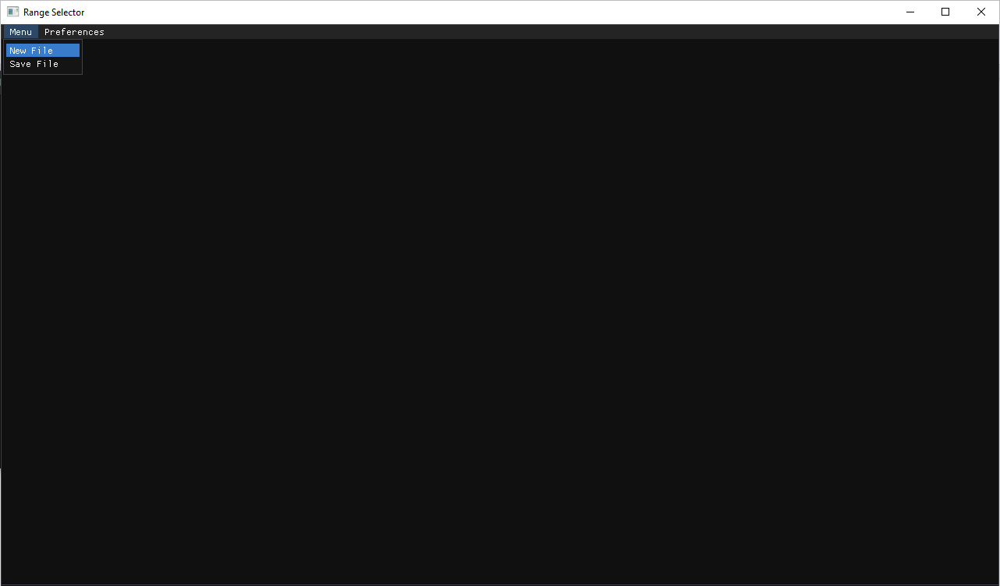
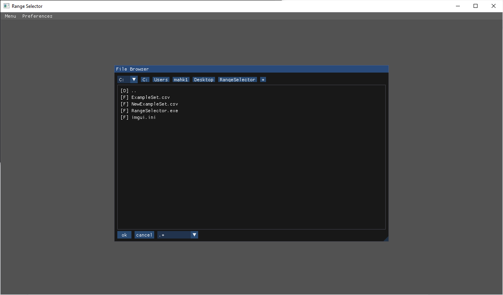
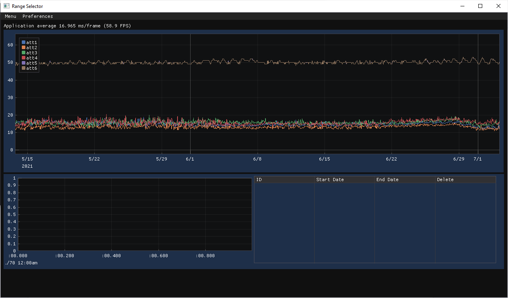
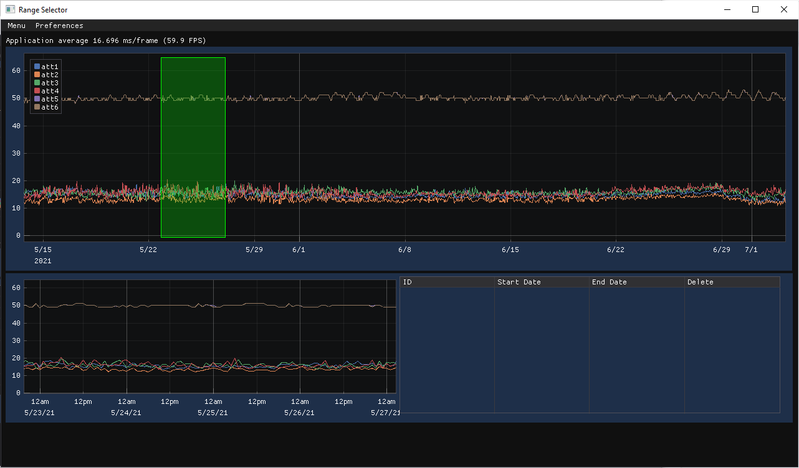
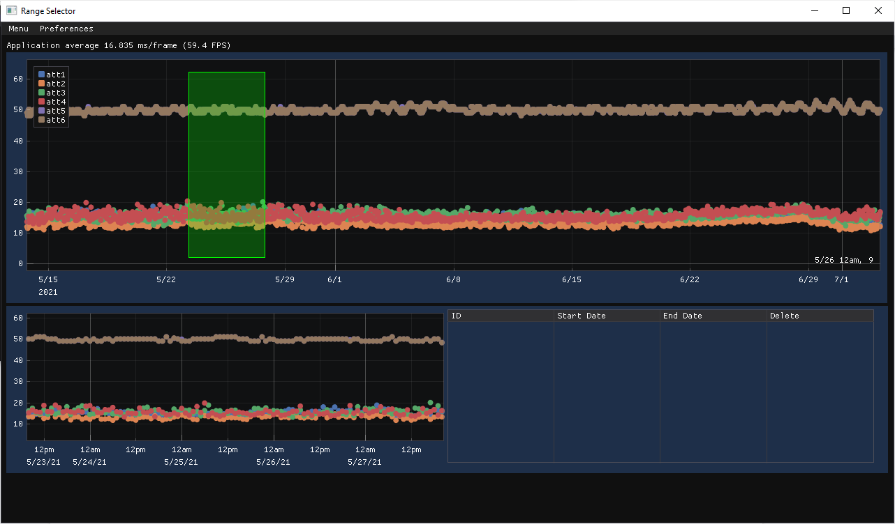
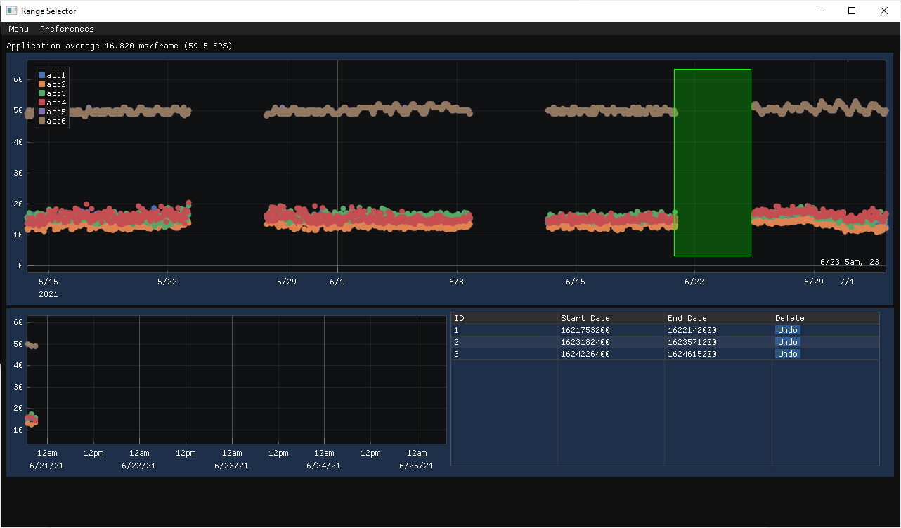

# Range_Selector
The Range Selector program was developed to ease the process of selecting normal ranges in time series data. The application accepts CSV files and UNIX time format.

# Images

